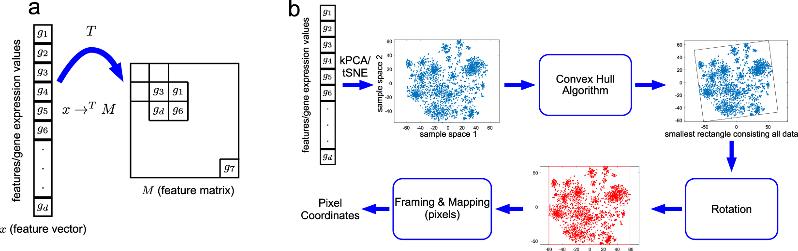
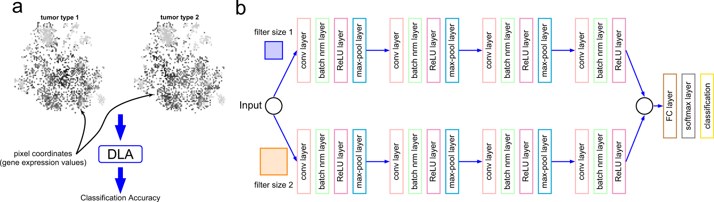

# DeepInsight

This repository contains the original MatLab code for DeepInsight as described in the paper [DeepInsight: A methodology to transform a non-image data to an image for convolution neural network architecture](https://doi.org/10.1038/s41598-019-47765-6), as well as a python implementation for some features. Moreover, version 2 of MatLab code for DeepInsight has also been released.

## DeepInsight pipeline

(**a**) An illustration of transformation from feature vector to feature matrix. (**b**) An illustration of the DeepInsight methodology to transform a feature vector to image pixels.

## DeepInsight Network

(**a**) Illustration of two types of tumors using the image transformation methodology of the DeepInsight method. The difference between the two types can be visualized at various points. These image samples are further processed to deep learning architecture (DLA); i.e., parallel CNN as depicted in part b of the same figure. (**b**) Parallel CNN architecture used in DeepInsight. This architecture consists of two parallel CNN architectures where each consists of four convolutional layers. Parameters are tuned using Bayesian Optimization technique.

# MatLab Code

Version 1: original package as described in the paper: https://github.com/alok-ai-lab/DeepInsight/tree/master/ver1

Version 2: updated package: https://github.com/alok-ai-lab/DeepInsight/tree/master/ver2

# pyDeepInsight

This package provides a python implementation of some features of DeepInsight. See the [pyDeepInsight GitHub Repository](https://github.com/alok-ai-lab/pyDeepInsight) for details.
